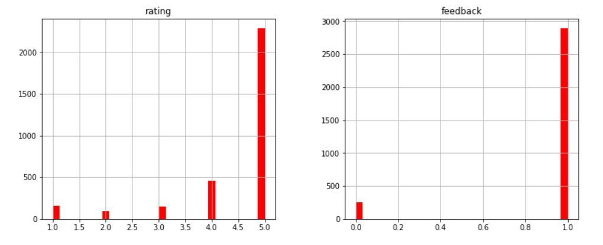
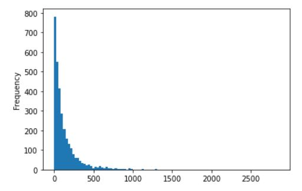
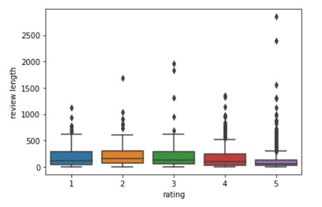
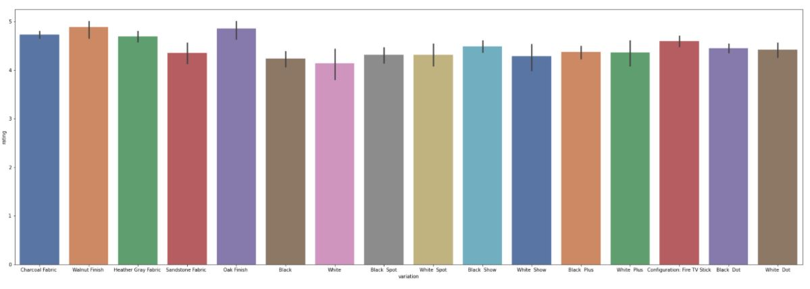
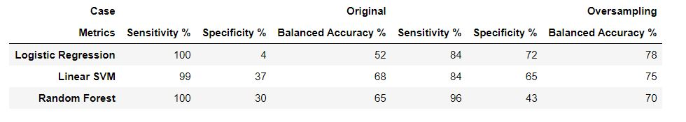

# 1. Overview

In this project, we build a text classifier to perform sentiment analysis for us. Sentiment analysis is the process to detect the negative or positive sentiment in text, and while any business entity that provide either a product or a service needs to gauge customer behavior toward its pricing plans or customer support, sentiment analysis comes as an optimal solution for businesses to understand customer needs and detect how their products / services perform in the market. However, in a more digitalized world where customer are more openly to express their feedback, it is inefficient, even impossible, to manually perform this analysis in such huge data sets. Sentiment analysis models can help us automate this process by predicting positive and negative review both in real time and over time.
***

# 2. Data set:
we use data set of customer reviews on Amazon Alexa which can be accessed [here](https://www.kaggle.com/sid321axn/amazon-alexa-reviews/kernels)

***

# 3. Analysis Summary

We can see that rating distribution indicates a dominant positive feedback as almost 3000 reviews are labeled as positive. The average value of ratings is ~ 4.5 and standard deviation of 1, with  257 labeled as negative.

Reviews tend to be longer with lower ratings indicating that users tend to be more expressive in negative experiences

Different variations has no significant impact on the rating, However, Oak finish is slightly more highly rated than other variations

# 4. Model Development

Standard classifiers suffer serious incapabality to discriminate the underrepresented class in imbalanced data sets. Many solution have been proposed to overcome skewed class distribution, one approachs deals with data preprocessing by resampling the data set (e.g. Oversampling) which will be our focus in this project, a second aproach is cost-sensitive learning (e.g. confidence threshold adjustment). 

First, we clean our data to replace all numbers and punctuation with empty strings, remove stop words and perform stemming using `NLTK`, we transform the text into numerical data and computing TF-IDF to measure the word importance in our text. then we train different models (Logistic Regression, SVM, Random Forest) the the imbalaned data set where we observe severe bias toward the majority class, particularly Logistic Regression model.

Secondly, we reduce dimensionality of our sparse matrix using TruncatedSVD (Singular Value Decomposition) in resampling stage to be in line with SMOTE which perform best with low-dimensional data.

Thridly, we perform resampling to modify the data set in order to reduce the discrepancy among the sizes of the classes. We stick to SMOTE method (Synthetic Minority Over-sampling Technique) which is based on creating synthetic instances for the minority classes. The algorithm takes each minority class sample and introduces synthetic samples along the line joining the current instance and some of its k nearest neighbours from the same class.

Although it is recommended to use a combination of oversampling and undersampling to manage skewed class distribution, we will stick to a focused oversampling approach due to data set size limitation.

Finally, We will compare the performance of our learners before and after resampling our data set based on `balanced accuracy` which  provides a better performance metric to deal with imbalanced data sets.

We observe that linear SVM comes first at performance in the imbalanced data set, followed by Random Forest, while Logisitic Regression is the most affected by imbalance. However, when used with a more balanced data, it achieves the best results among the other classifiers.  
